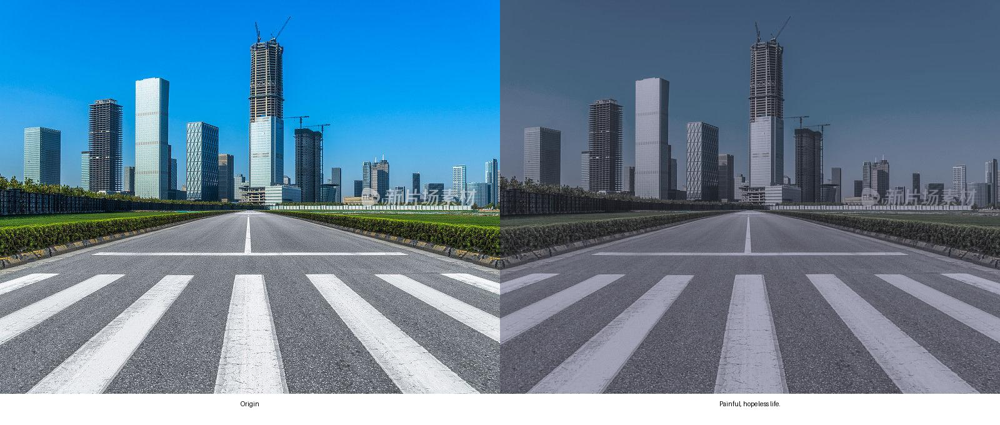
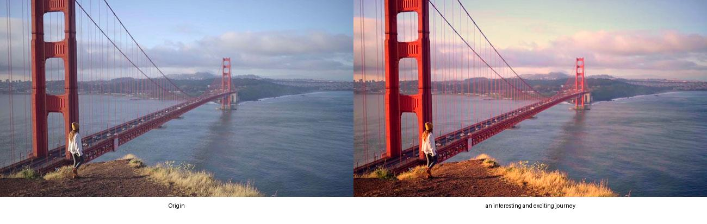
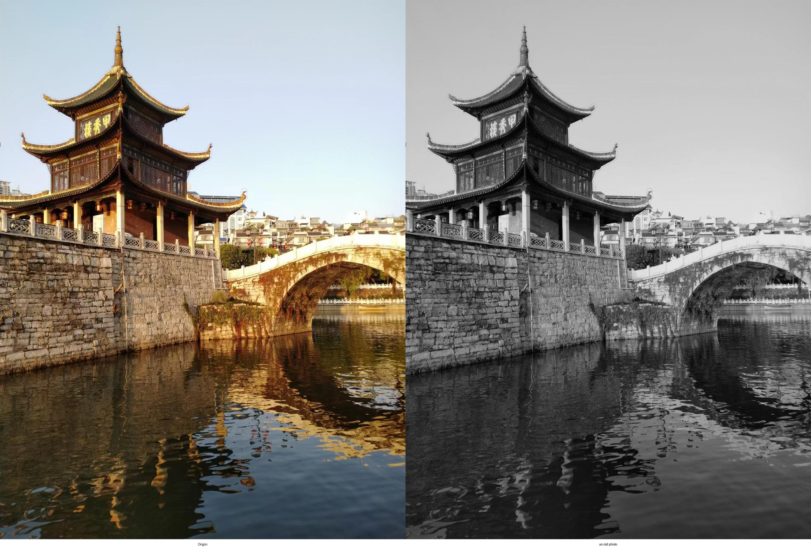
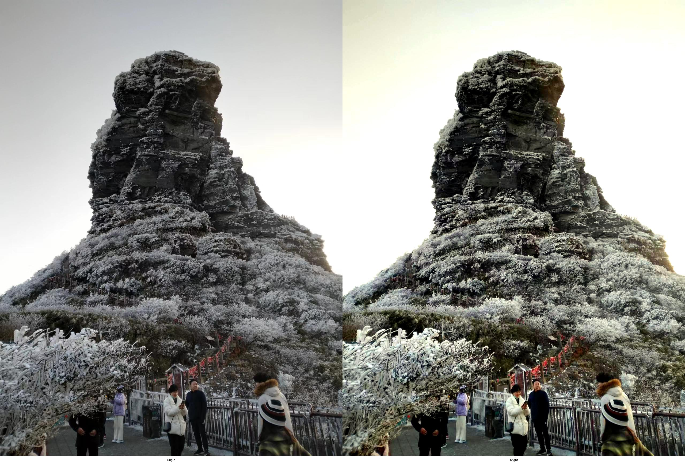

# InPhoto
Tool for intelligent photogragh

### Preview
"When I'm out traveling and want to capture and share the moments, or just when I feel like expressing my mood in everyday life, snapping a photo is super handy. But here's the catch: to get a photo that really shows off my personal style and feelings, I need to know all about tweaking different settings. That's a whole lot of time and money spent on getting good at photography. Or, I could just slap on some over-the-top filter or go for a stiff, cookie-cutter AI beauty effect. So, I'm thinking, why not make a photography tool that's more me? Something where I can just say what I'm feeling or what I'm looking for, and it'll jazz up my quick pics into something that's really my own, like my personal piece of art."

### Examples






### Tutorial(Local)

Step 1 API Key
set your openai api key
```
export OPENAI_API_KEY="<YOUR_API_KEY>"
```

Step 2 Requirements
```
pip install -r requirements.txt
```

Step 3 Image
put your images (any size) into dir '/input', which needs to be jpg.

Step 4 Prompt
edit the content of 'user_prompt' in ./config/prompt.txt,
like "relax" or "painful, gray life" 

Step 5 Run
in root dir of project
```
python main.py
```
that's it. You can see the result img in ./result after process finished.

### Tutorial(Server)

install requirements and export OPENAI_API_KEY，then
```
uvicorn server:app --reload
```

TODO LIST 
- [ ] More parameters for photogragh
- [ ] A bunch of "perfect" default parameters
- [ ] Automatic composition